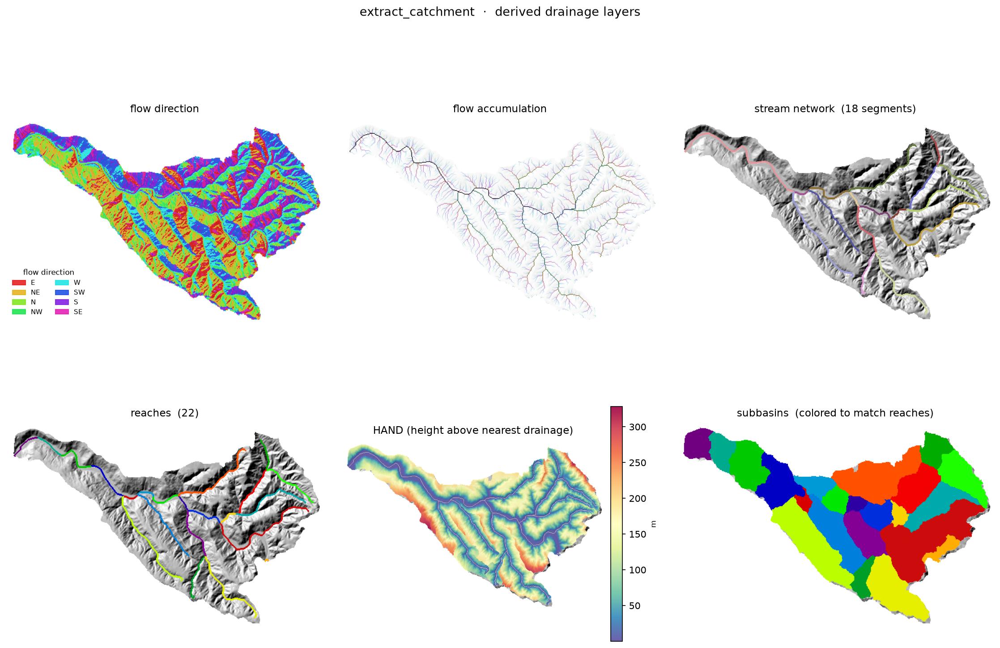

# catchment

Given a raw DEM and channel initiation points (from flowlines or a
contributing-area threshold), extract the full raster description of the
drainage system: conditioned DEM, flow direction/accumulation, labeled
channel network, subbasins, reaches, HAND, and the vectorized stream network.

```python
from catchment import extract_catchment

results = extract_catchment(dem, flowlines=flowlines)
# or: results = extract_catchment(dem, threshold_area=200_000)

results.flow_dir
results.flow_acc
results.stream_network
results.reaches
results.hand
results.subbasins
# results.vector_network
```



<sub>reaches and subbasins share the same IDs, so they're colored to match.</sub>

<sub>Regenerate: `uv run --group example python examples/plot.py`</sub>
